## 基本概念与知识

### 基本概念与重要平台、技术、工具

用一句话来描述区块链：区块链是一个共享的不可修改的账本，可用来记录一个网络上所有交易的历史。这里所说的"交易"翻译自"Transaction"。也可以将之称为"事务"，本文将之统一称为"交易"。

Hyperledger 是 Linux 基金会主持的一个开源项目，启动于 2015 年，其核心目标是建立开放的、标准化的、企业级的、能支持商业交易的分布式账本的框架与基础代码。

Hyperledger Fabric 是 Hyperledger 项目的一个组成部分，是一个区块链框架的实现。它将成为区块链应用开发、解决方案的基础。Fabric 框架支持组件化、可插拔的共识服务（Consensus Service）、成员服务（Membership Service）；"许可（Permissioned）"特性使之为"私有性"、"保密性"提供了可靠的解决方案；智能合约（Smart Contracts）在 Fabric 中通过"Chaincode"得以实现。Fabric 最初是由 Digital Asset、IBM 贡献给 Hyperledger 项目的。

Hyperledger Composer 也是 Hyperledger 项目的一个组成部分。通过它，人们可以更快速、容易地建立区块链业务模型，进行区块链网络及应用的开发、部署，并与现有系统、数据进行集成。

本文中，对于 Fabric 的学习，正是以 Composer 作为入口与基础工具，这样学习的效率更高。在学习初期，Fabric 与 Composer 的知识是紧密结合的，在后期，我们会对这两项技术分别深入学习、研究。

### 知识准备

区块链技术涉及到的技术比较多，本文希望能帮助读者将焦点一直放在区块链本身上，即使对某项技术学习得不是非常深入，也不会影响对于 Fabric 的学习。一般来说，希望读者还是能对以下知识预先有所了解：Ubuntu，Docker，Node.js，Javascript，npm，CA。

## 安装 Fabric 之前的环境准备

### Ubuntu 16.04 LTS 64-bit

Fabric 支持 MacOSX、*nix 或者 Windows 10 操作系统；Composer 支持 Ubuntu Linux 14.04 / 16.04 LTS (64-bit)或者 MacOS 10.12 操作系统。

现在，我们使用 **Ubuntu****16.04 LTS 64-bit**，作为我们的区块链部署系统。对于 Ubuntu 系统的安装与管理，这里不再详述，但可以通过以下命令确认版本信息：

#### 确认 Ubuntu Linux 版本

```
# cat /etc/issue
Ubuntu 16.04.4 LTS \n \l
# uname -a
```

### 系统用户

我们在学习过程中，几乎所有操作都通过一个专门的用户来完成（在本文示例中，使用的用户名为：fabric；读者可以根据需要使用自己的用户名，但请注意在后续示例中要相应修改）。请不要使用 root 用户。

#### 添加一个新用户

```
adduser fabric
```

#### 将此用户加入 sudo 用户组

```
usermod -aG sudo fabric
```

#### 切换为 fabric 用户，并进入用户目录

```
su fabric
$ cd ~
```

### 安装 Node.js, npm, Docker, Docker Compose, Python

现在需要安装 Node.js, Docker 等软件，Hyperledger 提供了一个脚本，可以用来自动安装。

#### 下载并执行自动安装脚本

```
$ curl -O https://hyperledger.github.io/composer/latest/prereqs-ubuntu.sh
$ chmod u+x prereqs-ubuntu.sh
$ ./prereqs-ubuntu.sh
```

安装成功后，会显示以下内容，包括安装的软件名称及版本号。（后续版本可能会有变化。）

```
Installation completed, versions installed are:
Node:             v8.14.0
npm:              6.4.1
Docker:           Docker version 18.09.0, build 4d60db4
Docker Compose:   docker-compose version 1.13.0, build 1719ceb
Python:           Python 2.7.12
Please logout then login before continuing.
```

#### 退出并重新登录(很重要！！！！)

**请退出当前用户会话，关闭客户端工具与 Ubuntu 的连接；并重新以用户 fabric** 登录 Ubuntu，以使系统设置生效。

如果是自行手动安装这几项软件但版本号并不完全一致，可能会给后续过程带来一些障碍。所以，为节约时间，尽量使用这个自动安装脚本；

## 使用 Hyperledger Composer 安装 Fabric Runtime

现在，终于要正式开始安装 Composer 和 Fabric 了。

### 安装 Composer

Hyperledger Composer 是一个开放的开发框架、工具集，可以帮助人们更容易地开发、部署区块链应用。它支持 Fabric，并提供 Javascript SDK。我们可以通过 npm 来安装它的一系列组件。

请注意，您**不应**使用`su`或`sudo`用于以下npm命令。

基本的CLI工具：

```
npm install -g composer-cli
```

用于在计算机上运行REST Server以将业务网络公开为RESTful API的实用程序：

```
npm install -g composer-rest-server
```

生成应用程序资产的有用工具：

```
npm install -g generator-hyperledger-composer
```

Yeoman是一个生成应用程序的工具，它利用`generator-hyperledger-composer`：

```
npm install -g yo
```

### 第2步：安装Playground

如果您已经在线尝试过Composer，那么您将看到浏览器应用程序“Playground”。您也可以在开发计算机上本地运行它，为您提供用于查看和演示业务网络的UI。

用于简单编辑和测试的浏览器应用商业网络：

```
npm install -g composer-playground
```

### 第３步：安装Hyperledger Fabric

此步骤为您提供了部署业务网络的本地Hyperledger Fabric运行时。

在选择的目录中（我们将假设`~/fabric-dev-servers`），获取`.tar.gz`包含安装Hyperledger Fabric的工具的文件：

复制

```
mkdir ~/fabric-dev-servers && cd ~/fabric-dev-servers

curl -O https://raw.githubusercontent.com/hyperledger/composer-tools/master/packages/fabric-dev-servers/fabric-dev-servers.tar.gz
tar -ｚxvf fabric-dev-servers.tar.gz
```

使用刚下载和解压缩的脚本下载本地Hyperledger Fabric v1.2.1运行时：

```
cd ~/fabric-dev-servers
export FABRIC_VERSION=hlfv12
./downloadFabric.sh
```

# 控制您的开发环境

## 启动和停止Hyperledger Fabric

#### 第一次启动新运行时，您需要运行启动脚本，然后生成PeerAdmin卡：

```
cd ~/fabric-dev-servers
export FABRIC_VERSION=hlfv12
./startFabric.sh
./createPeerAdminCard.sh
```

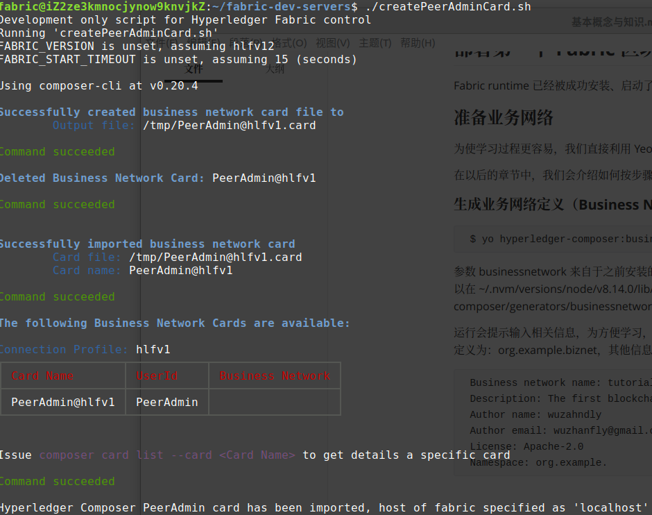

这个脚本会生成一个 Card 文件，它包含了 Fabric 网络的信息以及管理员 PeerAdmin 与之连接所必须的信息；即管理员的身份证明文件；生成后这个文件会被导入到 Composer，你可以在~/.composer/cards/PeerAdmin@hlfv1 目录下找到被导入的 PeerAdmin Card 的文件内容。之后，Composer 会利用这个 Card 文件建立起到 Fabric 网络的连接。

您可以使用启动和停止运行时`~/fabric-dev-servers/stopFabric.sh`，然后重新启动它`~/fabric-dev-servers/startFabric.sh`。

在开发结束时，运行`~/fabric-dev-servers/stopFabric.sh`，然后`~/fabric-dev-servers/teardownFabric.sh`。

#### 请注意，如果您运行了拆卸脚本，则下次启动运行时时，您需要创建一个新的PeerAdmin卡，即重复第一次启动时一样。

### 补充：使用docker ps 查询是否有容器在运行，若有使用以下命令停止：

```
docker stop $(docker ps -aq)
docker rm $(docker ps -aq)
docker network prune
```

## 部署第一个 Fabric 区块链业务网络

Fabric runtime 已经被成功安装、启动了，现在我们要部署第一个 Fabric 区块链业务网络。

### 准备业务网络

为使学习过程更容易，我们直接利用 Yeoman 及已经下载的 Generator 生成区块链网络框架。

在以后的章节中，我们会介绍如何按步骤手工完成定义、部署过程。

#### 生成业务网络定义（Business Network Definition – BND）

```
`$ yo hyperledger-composer:businessnetwork`
```

参数 businessnetwork 来自于之前安装的 generator-hyperledger-composer，表示了一组对应的模板文件。可以在 ~/.nvm/versions/node/v8.14.0/lib/node_modules/generator-hyperledger-composer/generators/businessnetwork/templates/ 下找到即将生成的内容的模板。

运行会提示输入相关信息，为方便学习，建议 Business network name 定义为：tutorial-network；Namespace 定义为：org.example.biznet，其他信息可以自行决定内容。将定义的内容如下：

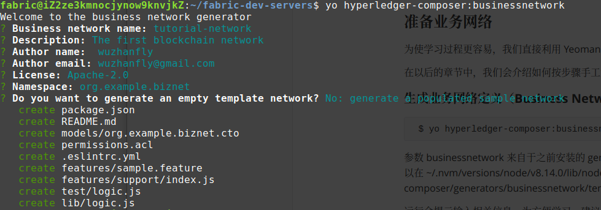

执行成功后，在当前 ~/fabric-dev-servers 目录下，新增了一个目录 tutorial-network, 这就是将要部署的区块链业务网络定义。

#### 进入 tutorial-network 目录

```
$ cd ~/fabric-dev-servers/tutorial-network
```

#### 后续的操作基本都在此目录下完成。

#### 生成 .bna 文件

```
$ composer archive create -t dir -n .
```

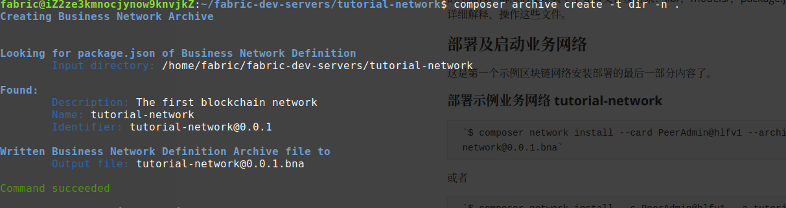

执行成功后，在当前目录下会产生一个新文件 tutorial-network@0.0.1.bna，即是 tutorial-network 目录下文件的压缩包。解压后发现其中主要有文件及目录：lib/，models/，package.json，permissions.acl。我们会在以后详细解释、操作这些文件。

### 部署及启动业务网络

这是第一个示例区块链网络安装部署的最后一部分内容了。

#### 部署示例业务网络 tutorial-network

```
`$ composer network install --card PeerAdmin@hlfv1 --archiveFile tutorial-network@0.0.1.bna`
```

或者

```
`$ composer network install --c PeerAdmin@hlfv1 --a tutorial-network@0.0.1.bna`
```

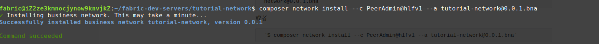

"composer network install" 命令会部署指定的 .bna 文件到 Fabric 网络。.bna 文件包括了这个业务网络的 Assets 模型、交易事务逻辑、访问控制规则等定义，但它并不能直接在 Fabric 上运行。.bna 文件是由 Composer 生成的，它是用 Composer 提供支持的一系列建模语言、规范定义的业务网络定义，我们必须将它先安装在 Fabric Peer 节点上。然后才可以在这个节点上启动运行这个业务网络。

参数 -c (--card) 应指定为在上一步骤中生成 PeerAdmin Card 文件。

参数 -a (--archiveFile) 应指定为将要部署的业务网络文件包。

#### 启动业务网络

```
$ composer network start --networkName tutorial-network --networkVersion 0.0.1 --networkAdmin admin --networkAdminEnrollSecret adminpw --card PeerAdmin@hlfv1 --file networkadmin.card
```

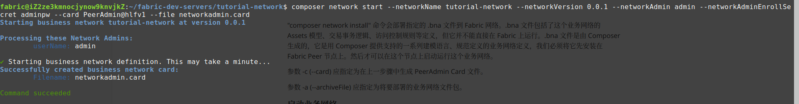

"composer network start" 用指定的 Card 启动这个网络；同时会生成一个当前业务网络的管理员 Card 文件，即此示例中的 networkadmin.card。

这个文件是 zip 格式的压缩文件，解压缩后，可以发现包含两个文件：connection.json, metadata.json。其中，metadata.json 内容如下：

```
`{
"version":1,
"userName":"admin",
"businessNetwork":"tutorial-network",
"enrollmentSecret":"adminpw"
}'
```

"admin", "tutorial-network" 正是我们此前的定义的管理员用户名，及业务网络名。我们在以后可以通过类似 -c admin@tutorial-network 使用这个管理员身份。

#### 导入 tutorial-network 管理员 Card

```
`$ composer card import --file networkadmin.card`
```

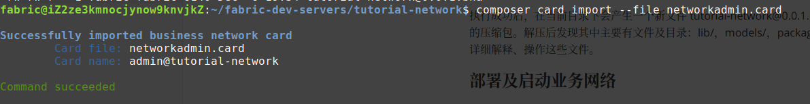

此时再查看 ~/.composer/cards 会发现新导入的 Card 文件。也可以直接通过命令查看。

#### 查看导入的 Card 文件

```
$ composer card list

The following Business Network Cards are available:
Connection Profile: hlfv1
┌────────────────────────┬───────────┬──────────────────┐
│ Card Name              │ UserId    │ Business Network │
├────────────────────────┼───────────┼──────────────────┤
│ admin@tutorial-network │ admin     │ tutorial-network │
├────────────────────────┼───────────┼──────────────────┤
│ PeerAdmin@hlfv1        │ PeerAdmin │                  │
└────────────────────────┴───────────┴──────────────────┘
```

#### 确认 tutorial-network 安装成功

```
$ composer network ping --card admin@tutorial-network
```

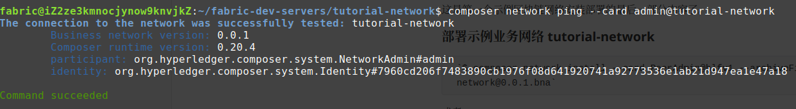

#### 启动 REST Server

```
`$ composer-rest-server -c admin@tutorial-network -n never`
```

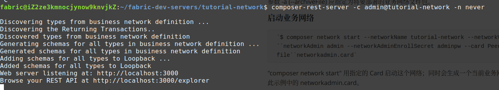

composer-rest-server 会根据部署的业务网络生成一系列 REST API,以方便用户通过浏览器或其他类似 curl 的应用程序访问这个区块链业务网络。如果在本机，我们可以通过这样的地址访问：

http://localhost:3000/explorer

#### 部署成功

到这里，我们就成功地通过 Hyperledger Composer 安装了 Hyperledger Fabric，并部署、启动了第一个区块链业务网络 tutorial-network。

## 访问区块链网络

### 通过浏览器访问 REST Service

在浏览器中输入 http://localhost:3000/explorer

##### 图 1. 入口界面

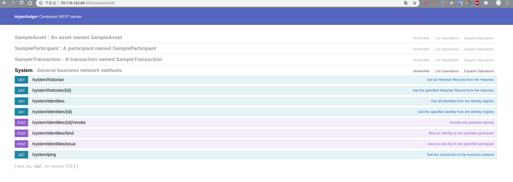


SampleAsset 是这个区块链业务网络中定义的资产模型 (Asset)。表示一种有形或无形的可改变、转移的商品。

SampleParticipant 是这个业务网络的成员 (Participant)，可以拥有 Asset，提交 Transaction。

SampleTransaction 是一种交易或事务 (Transaction)，由成员提交到业务网络，用以改变、转移商品，或触发其他操作。

这些内容都可点击展开，显示 REST API 中对于此项内容的所有操作。

##### 图 2. Participant 操作

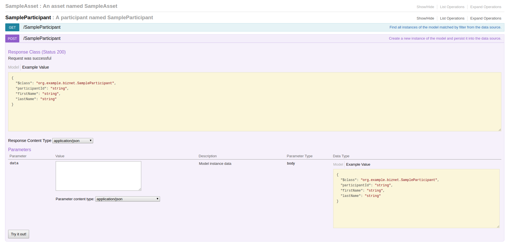

点击 **GET**，**POST** 等按钮，可以进行展开并进行各种操作。

点击 **POST** 按钮，可添加一个新的 SampleParticipant

##### 图 3. 添加 SampleParticipant

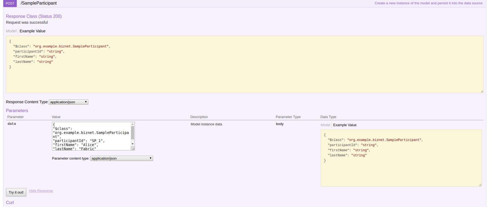

在 data 输入框中，输入如下内容：

```
{
"$class": "org.example.biznet.SampleParticipant",
"participantId": "SP_1",
"firstName": "Alice",
"lastName": "Fabric"
}
```

"org.example.biznet.SampleParticipant" 是将要添加 Participant 的模型名称；"SP_1" 是当前业务网络中这种实例的唯一 ID。

点击 **Try it out!** 按钮，REST Service 会向这个区块链业务网络添加新的 SampleParticipant。如果添加成功，会在界面下方显示 "Response Code 200" 类似的输出内容。

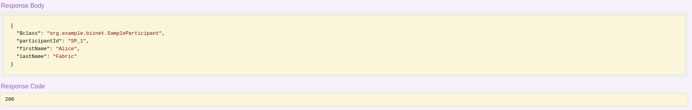

添加成功后，再点击第一个操作 **GET**，展开后点击 **Try it out!** 按钮，即可列出所有 SampleParticipant。

##### 图 4. 列出所有 SampleParticipant

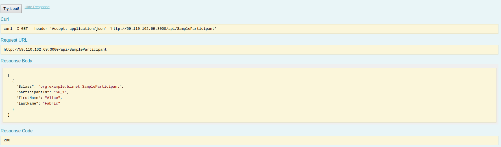

##### 图 5. Asset 操作

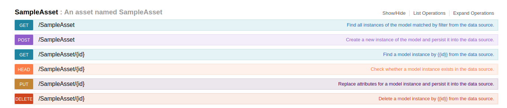

点击 **GET**，**POST** 等按钮，可以进行 SampleAsset 各种操作。

点击 **POST** 按钮，可添加一个新的 SampleAsset。

##### 图 6. 添加一个新的 SampleAsset

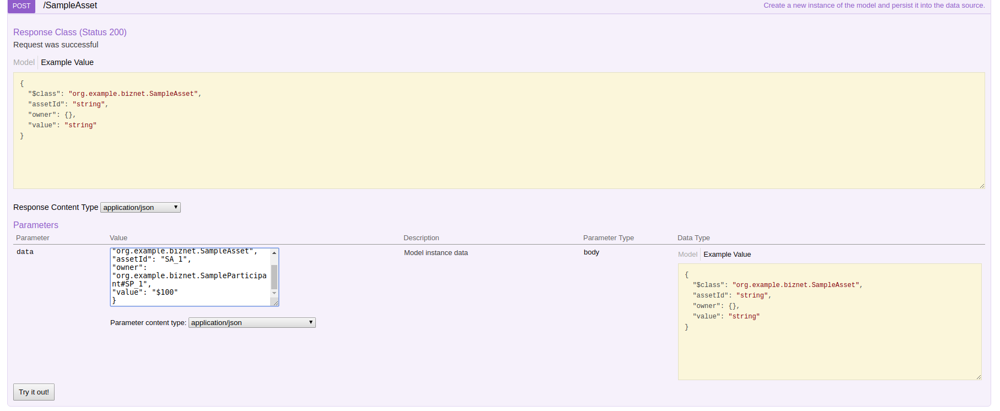

在 data 输入框中，输入如下内容：

```
{
"$class": "org.example.biznet.SampleAsset",
"assetId": "SA_1",
"owner": "org.example.biznet.SampleParticipant#SP_1",
"value": "$100"
}
```

"org.example.biznet.SampleAsset" 是将要添加实例的模型名；"SA_1" 是当前业务网络中这种实例的唯一 ID。"org.example.biznet.SampleParticipant#SP_1" 是对于之前建立的 ID 为 SP_1 的 SampleParticipant 的引用。

我们会在以后详细分析这个模型的定义方法。

点击 **Try it out!** 按钮，REST Service 会向这个区块链业务网络添加新的 SampleAsset。如果添加成功，会在界面下方显示 "Response Code 200" 类似的输出内容。

按此方法，我们可以再添加另一个 SampleAsset，其 ID 为 SA_2。

添加成功后，再点击第一个操作 **GET**，展开后点击 **Try it out!** 按钮，即可列出所有 SampleAsset。

##### 图 7. 列出所有 SampleAsset

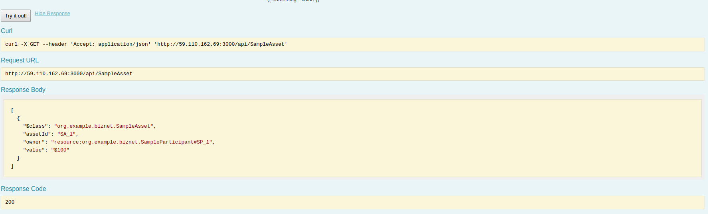

在 Response Body 中，可以发现以 JSON 格式列出的所有 SampleAsset 实例。

##### 图 8. 交易（Transaction）操作

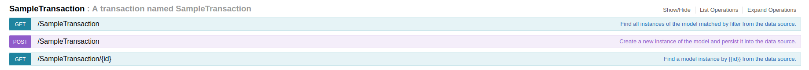

点击 **GET**，**POST** 等按钮，可以进行交易的各种操作。

点击 **POST** 按钮，可提交一个新的交易。

##### 提交交易（Transaction）

在 data 输入框中输入以下内容：

```
{
"$class": "org.example.biznet.SampleTransaction",
"asset": "org.example.biznet.SampleAsset#SA_1",
"newValue": "$105"
}
```

"org.example.biznet.SampleTransaction" 是将要提交的交易模型名称；"org.example.biznet. SampleTransaction#SA_1" 是之前添加的 SampleAsset 实例的引用；newValue"$105" 是指将这个 SampleAsset 实例中的 value 改成新的值 "$105"。

点击 **Try it out!** 按钮，REST Service 会向这个区块链业务网络提交这个交易。如果提交成功，会在界面下方显示 "Response Code 200" 类似的输出内容。

提交成功后，我们再次操作 SampleAsset - GET， 即可发现 SampleAsset#SA_1 的 value 已经被改为 "$105"。

"newValue" 这个操作的具体逻辑是在 ~/fabric-tools/tutorial-network/lib/logic.js 中定义的。其中所使用的 API，如 getAssetRegistry、getFactory 正是 Composer 提供的 Javascript API，这段 JS 会由被先前安装部署在 Peer 上的 Composer 业务网络执行。

在 SampleTransaction – GET 中，点击 **Try it out!** ，即可列出所有提交成功的交易。

##### 图 9. 列出所有交易

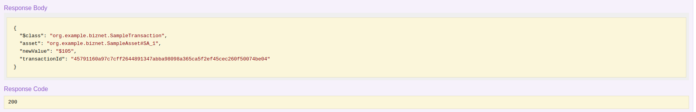

这里，每个交易比之前提交的内容，多了 transactionId, timestamp 两个内容，这是 tutorial-network 在处理交易时自动添加的。

##### 图 10. System 操作

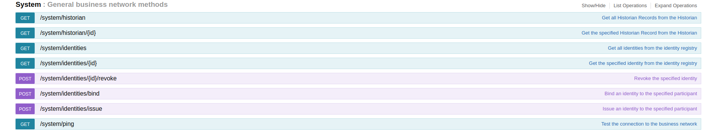

通过 System – GET /system/historian 操作，可以列出这个业务网络的历史操作记录。部分内容如下：

```
[
  {
    "$class": "org.hyperledger.composer.system.HistorianRecord",
    "transactionId": "2498bf0c956ee14b20cbdeb3ec3b366ec3a16eaf0f760f3d57f64e3c5d6b7a10",
    "transactionType": "org.hyperledger.composer.system.StartBusinessNetwork",
    "transactionInvoked": "resource:org.hyperledger.composer.system.StartBusinessNetwork#2498bf0c956ee14b20cbdeb3ec3b366ec3a16eaf0f760f3d57f64e3c5d6b7a10",
    "eventsEmitted": [],
    "transactionTimestamp": "2018-12-06T14:55:00.341Z"
  },
  {
    "$class": "org.hyperledger.composer.system.HistorianRecord",
    "transactionId": "2498bf0c956ee14b20cbdeb3ec3b366ec3a16eaf0f760f3d57f64e3c5d6b7a10#0",
    "transactionType": "org.hyperledger.composer.system.AddParticipant",
    "transactionInvoked": "resource:org.hyperledger.composer.system.AddParticipant#2498bf0c956ee14b20cbdeb3ec3b366ec3a16eaf0f760f3d57f64e3c5d6b7a10#0",
    "eventsEmitted": [],
    "transactionTimestamp": "2018-12-06T14:55:00.339Z"
  },
  {
    "$class": "org.hyperledger.composer.system.HistorianRecord",
    "transactionId": "2498bf0c956ee14b20cbdeb3ec3b366ec3a16eaf0f760f3d57f64e3c5d6b7a10#1",
    "transactionType": "org.hyperledger.composer.system.IssueIdentity",
    "transactionInvoked": "resource:org.hyperledger.composer.system.IssueIdentity#2498bf0c956ee14b20cbdeb3ec3b366ec3a16eaf0f760f3d57f64e3c5d6b7a10#1",
    "eventsEmitted": [],
    "transactionTimestamp": "2018-12-06T14:55:00.340Z"
  },
  {
    "$class": "org.hyperledger.composer.system.HistorianRecord",
    "transactionId": "45791160a97c7cff2644891347abba98098a365ca5f2ef45cec260f50074be04",
    "transactionType": "org.example.biznet.SampleTransaction",
    "transactionInvoked": "resource:org.example.biznet.SampleTransaction#45791160a97c7cff2644891347abba98098a365ca5f2ef45cec260f50074be04",
    "participantInvoking": "resource:org.hyperledger.composer.system.NetworkAdmin#admin",
    "identityUsed": "resource:org.hyperledger.composer.system.Identity#7960cd206f7483890cb1976f08d641920741a92773536e1ab21d947ea1e47a18",
    "eventsEmitted": [
      {
        "$class": "org.example.biznet.SampleEvent",
        "asset": "resource:org.example.biznet.SampleAsset#SA_1",
        "oldValue": "$100",
        "newValue": "$105",
        "eventId": "45791160a97c7cff2644891347abba98098a365ca5f2ef45cec260f50074be04#0",
        "timestamp": "2018-12-06T15:24:17.372Z"
      }
    ],
    "transactionTimestamp": "2018-12-06T15:24:17.372Z"
  },
  {
    "$class": "org.hyperledger.composer.system.HistorianRecord",
    "transactionId": "5c9b1b35e47246d9bed14fcfd883fa8b6c5e5f86d46b8da0c7984d9db9f7807a",
    "transactionType": "org.hyperledger.composer.system.AddParticipant",
    "transactionInvoked": "resource:org.hyperledger.composer.system.AddParticipant#5c9b1b35e47246d9bed14fcfd883fa8b6c5e5f86d46b8da0c7984d9db9f7807a",
    "participantInvoking": "resource:org.hyperledger.composer.system.NetworkAdmin#admin",
    "identityUsed": "resource:org.hyperledger.composer.system.Identity#7960cd206f7483890cb1976f08d641920741a92773536e1ab21d947ea1e47a18",
    "eventsEmitted": [],
    "transactionTimestamp": "2018-12-06T15:12:15.250Z"
  },
  {
    "$class": "org.hyperledger.composer.system.HistorianRecord",
    "transactionId": "5e9da79cf6d12e7245da82ceae6b5bfbd84a6927e174e2c01951c4752b588ed3",
    "transactionType": "org.hyperledger.composer.system.AddAsset",
    "transactionInvoked": "resource:org.hyperledger.composer.system.AddAsset#5e9da79cf6d12e7245da82ceae6b5bfbd84a6927e174e2c01951c4752b588ed3",
    "participantInvoking": "resource:org.hyperledger.composer.system.NetworkAdmin#admin",
    "identityUsed": "resource:org.hyperledger.composer.system.Identity#7960cd206f7483890cb1976f08d641920741a92773536e1ab21d947ea1e47a18",
    "eventsEmitted": [],
    "transactionTimestamp": "2018-12-06T15:21:29.899Z"
  },
  {
    "$class": "org.hyperledger.composer.system.HistorianRecord",
    "transactionId": "a8b635f41fc5d0e2071b3a3970dbe53899e62785820566cfcaba814402604eee",
    "transactionType": "org.hyperledger.composer.system.ActivateCurrentIdentity",
    "transactionInvoked": "resource:org.hyperledger.composer.system.ActivateCurrentIdentity#a8b635f41fc5d0e2071b3a3970dbe53899e62785820566cfcaba814402604eee",
    "identityUsed": "resource:org.hyperledger.composer.system.Identity#01899e04161a3a6d64670504fa122e55818295352929b6a616333a3739fde3f2",
    "eventsEmitted": [],
    "transactionTimestamp": "2018-12-06T14:59:47.115Z"
  }
]
```

示例中有 3 个操作：AddAsset, AddParticipant, SampleTransaction, StartBusinessNetwork。

其中 SampleTransaction 是我们之前手工提交的 Transaction；而 AddAsset, AddParticipant, StartBusinessNetwork 则是业务网络自己产生的事务操作历史记录。由此我们可以知道，当前 tutorial-network 中的一些操作（如：添加 SampleAsset）其实是通过一系列 Composer 模型语言定义了一个操作，由 Composer 提交到 Fabric Peer Node，最终由业务网络执行完成的，即智能合约（Smart Contract）在 Fabric 中的实现：Chaincode。

按上述方法，可以浏览这个简单的区块链网络所提供服务的所有 REST API。

### 使用 curl 访问 REST Service

以上介绍的在浏览器中对 REST Service 及区块链网络的访问，都可以通过 curl 及其他类似应用程序，通过控制台进行。

#### 使用 curl 程序调用 REST API – GET SampleAsset

```
`$ curl -X GET --header 'Accept: application/json'``'http://fabric11dev1:3000/api/SampleAsset'`
```

为方便起见，这里并没有指定任何用户信息，因为目前没有加入安全验证机制

执行成功后，会返回 JSON 格式的文本。

#### 使用 curl 程序调用 REST API – POST SampleTransaction

```
`$ curl -X POST --header 'Content-Type: application/json' --header 'Accept:``application/json' -d '{ ``"$class": "org.example.biznet.SampleTransaction",``"asset": "org.example.biznet.SampleAsset#SA_1",``"newValue": "$110"``}' 'http://fabric11dev1:3000/api/SampleTransaction'`
```

## 结语

这对于 Fabric 的的学习还是初步的，旨在迅速建立对 Fabric 的直观映像，以便为下一步深入研究打好基础。